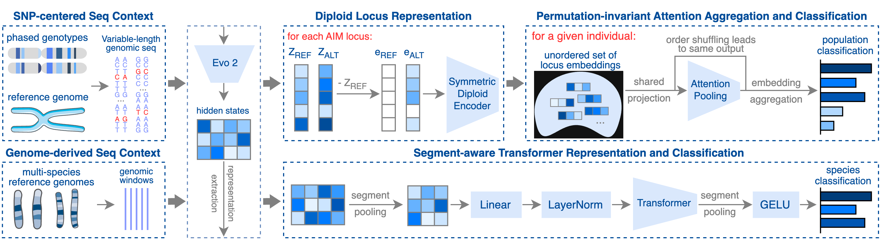

# EvoGR (Evo 2-based Genomic Representation)

本仓库实现论文 **Structure-aware transfer of pretrained genomic representations for population and cross-clade classification** 中提出的 EvoGR 方法。

## Model Architecture

EvoGR 使用预训练的 Evo 2 提取基因组序列表示，并结合局部上下文与变异信息构建结构感知的基因组表示，最后用于 population classification 和 cross-clade classification。Evo 2 主干保持冻结，分类头可根据任务进行训练。



## 快速使用

### 1. 安装依赖

建议使用 Python 3.10 或更高版本，并在具有 CUDA 或 Apple Silicon 加速的环境中运行 Evo 2 推理。

```bash
python -m venv .venv
source .venv/bin/activate       # Windows: .venv\\Scripts\\activate
pip install -r requirements.txt
```

设置源码路径：

```bash
export PYTHONPATH="$PWD/population/src:$PWD/cross_clade/src:$PYTHONPATH"
```

### 2. Population classification

准备数据、Evo 2 模型检查点和对应配置文件后，运行完整流程：

```bash
python population/scripts/run_pipeline.py --config configs/base.yaml
```

也可以分别运行数据检查、序列构建、Evo 2 表征提取、交叉验证和结果验证脚本。各脚本位于 `population/scripts/`。

### 3. Cross-clade classification

准备 cross-clade 配置和输入数据后，运行交叉验证：

```bash
python cross_clade/scripts/run_cv.py \
  --head transformer \
  --config configs/experiment.yaml
```

可选分类头包括 `baseline` 和 `transformer`。

## 目录结构

```text
population/      population classification 流程
cross_clade/     cross-clade classification 流程
data/            数据说明
fig/             方法架构图
```

